# NBA Player Classification

Author: Hogan Byun

## Project Overview

The game of basketball has certainly evolved over time. Point guards are no longer relagated to just passing duties, centers are no longer just tall players who post-up and rebound. As a result, classifying players by position starts to become less relevant as teams move into an era of "positionless" basketball, where players are asked to play and guard multiple positions. This project provides different ways to classify players into playstyles rather than the traditional five positions (PG, SG, SF, PF, C). Using these classifications, NBA teams can find a better understanding of the types of players that succesful teams have and unsuccessful teams lack. This can prove to be useful to teams that want to identify initial steps to improve their rosters.

* This project has been updated in the "modeling pt 2" folder.

## The Data

All the data has been curated from https://www.basketball-reference.com/ and https://www.nba.com/stats/

In total, there were 3,067 player seasons used for this project. These players include all players from 2015-2021 that have at least 20% of his respective team's games. The abbreviations for each stat are listed below:

* **Player** - Player name
* **GP** - Games played
* **MIN** - Minutes played per game
* **PTS** - Points per game
* **FGA** -  Field goal attempts per game
* **FG%** -  Field goal percentage
* **3PA** -  3-point attempts per game
* **3P%** -  3-point percentage
* **REB** -  Rebounds per game
* **AST** -  Assists per game
* **TO** - Turnovers per game
* **STL** - Steals per game
* **BLK** - Blocks per game
* **Close FGA** - Close field goal attempts per game (defined by any shot closer than a midrange shot)
* **Close FG%** - Close field goal percentage
* **Mid FGA** - Midrange field goal attempts per game
* **Mid FG%** - Midrange field goal percentage
* **Post_ups** - Post-ups per game
* **Drives** - Drives per game
* **CS_3PA** - Catch-and-shoot 3-point attempts per game
* **CS_3P%** - Catch-and-shoot 3-point percentage
* **PP100Pos** - Points per 100 possessions
* **AST%** - Percentage of team assists credited to that player
* **REB%** - Percentage of total available rebounds credited to that player
* **USG%** - Estimate of the percentage of team plays used by a player while he was on the floor: calculated by 100*((Player's Field Goal Attempts)+0.44*(Player's Free Throw Attempts)+(Player's Turnovers))*(Team's Total Minutes)
* **Height** - Player height in inches
* **Pos** - Player's position
* **Class** - Player's playstyle (number varies depending on model)
* **TEAM** - Player's team

## Methods
### Semi-Supervised Learning

This project analyzes NBA player statistics to claassify players into distinct playstyles/classes. Two methods were implemented in this project, semi-supervised and unsupervised learning. 

In **semi-supervised learning**, labels were predetermined, those being the following 11 playstyles:
* **Pass-First Guard** - High assist rate, not a primary scorer, tends to be shorter in height
* **Stretch Big** - Shoots 3-pointers and rebounds well, taller height
* **Traditional Big** - High rebound and block rate, mainly shoots from close range
* **Perimeter Scorer** - Shoots a lot of 3-pointers and makes them at an above average rate
* **High Usage Big** - Big man with a high usage rate, scores a lot of points and is an above average facilitator
* **Ball Dominant Scorer** - The "number 1" option on a team, go-to scorer who also handles the ball and runs the offense
* **Athletic Slasher** - High drive and close shot rate, can shoot 3-pointers but does so at a below average level
* **Volume Scorer** - Shoots a lot though not always efficiently, minimal contributions elsewhere
* **Versatile Role Player** - Role player who contributes everywhere but does not excel in any area
* **Role Player** - Does not have enough counting statistics to be classified somewhere

These labels were manually applied to 352 players based on my own opinion. I made sure to have at least 30 and less than 40 of each playstyle in the 352 players. The model was trained on this data, after which, label predictions were made and applied to the remaining unlabeled players to create a fully-labeled dataset. Our final model was trained on that dataset. Several classification methods (Random Forest, XGBoost, SVM, etc.) were utilized and optimized to narrow down to a best-fit model, and on both occasions, XGBoost yielded the best results.

### Unsupervised Learning
In **unsupervised learning**, players were not labeled beforehand. Instead, we used k-means clustering to separate the data into distinct groups, yielding these 7 categories, which will be discussed in the **Results** section

* This project will be following the OSEMN data-science process

## Background/Issues Addressed
Before we get into the results, there are a few things that need to be mentioned:

### Dealing with Multiple Seasons of the Same Player
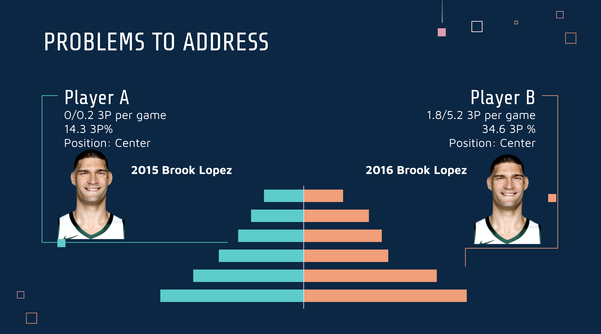

The graphic from our powerpoint above shows two interesting points. **1)** A player's position does not determine the player's playstyle. **2)** A player may not play the same way throughout his career. A prime example is Brook Lopez who in one year raised the number of 3-pointers he shot by around **2500%**! In one season, he went from a *Traditional Big* to a *Stretch Big*. In order to account for this, each season of a player counted as separate players. In other words, 2015 Brook Lopez and 2016 Brook Lopez were counted as different players in our model. This process was repeated for each player from 2015-2021, which also helps in giving us more data to work with.

### 3-Point Era
There is no doubt that recent years have seen a boom in 3-point shooting. Teams started to realize that rather than shooting a midrange shot for 2 points, it is much more efficient to take a few steps back and shoot for 3 points. We can see that there has been a constant increas in 3-point shots and a corresponding decrease in 2-point shots. The big turning point was thought to be in following the 2014-15 season, when **1)** Stephen Curry, who is widely considered to be the best shooter ever, won his first MVP, **2)** his team, the Golden State Warriors finished with the best 3-point percentage in the NBA (39.8%) and **3)** the Warriors finished with the record in the NBA (67-15) and were NBA champions. The Warriors would continue to find great success as a team built on shooting 3-pointers.

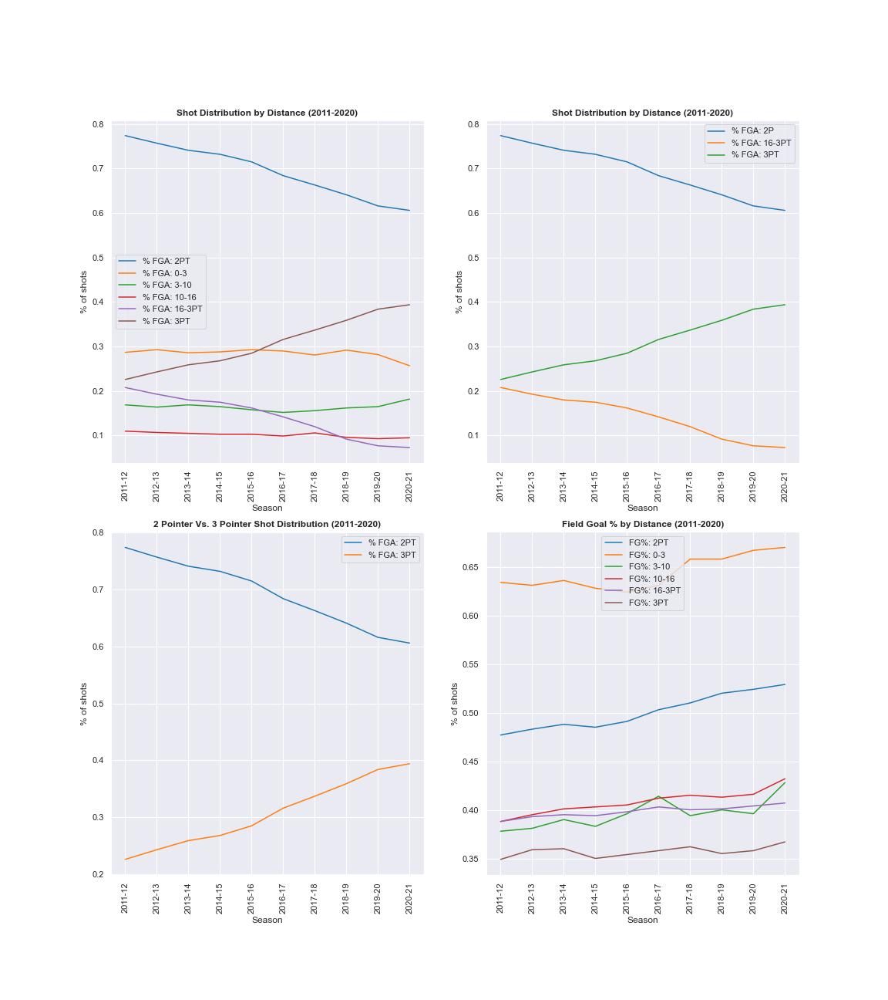

Above show the recent trends in shot location, some with more detail than others.

## Results
### Semi-Supervised Learning
As mentioned above, this method required two stages of modeling. The first stage was trained on the 352 pre-labeled players yielding these results

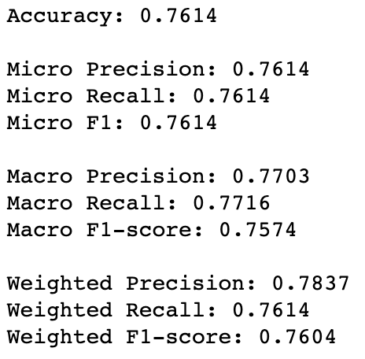

Here, micro, macro, and weighted are three different ways to measure the respective metrics. **Micro** aggregates contributions of all classes to get an average metric, **Macro** independently calculates metrics for each class, then averages them, and **Weighted** independently calculates metrics for each class, then averages them after giving weights corresponding to each class’ proportion in the dataset. What is evident is that all the numbers are pretty similar, generally falling within the 76-78% range. While this accuracy is not perfect, it is respectable for a dataset of 352, as it reached our minimum 70% accuracy goal.

Our second stage uses the original dataset after using our stage 1 model to label everyone else. Our results were as followed:
 
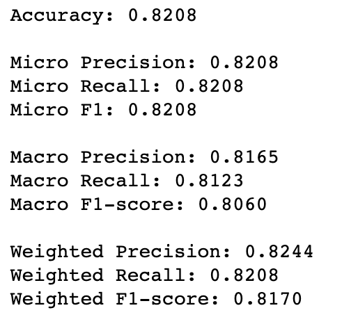

The 82% accuracy also was able to exceed our 80% accuracy goal. Below is the confusion matrix,

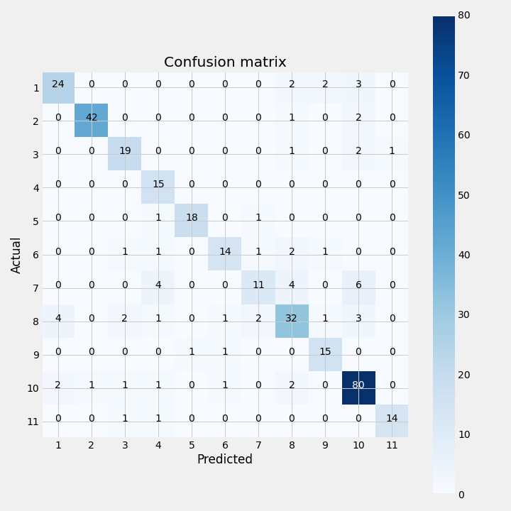

We can see that although we started out with around the same number of each class, there are definitely more of one class than others, that being class 10 (Role Player). This makes sense because an NBA team only has 5 starters and a few bench players that earn enough minutes to contribute enough to be classified. However, an average NBA team has 12 players, of which, quite a few may not receive enough minutes to be classified. 

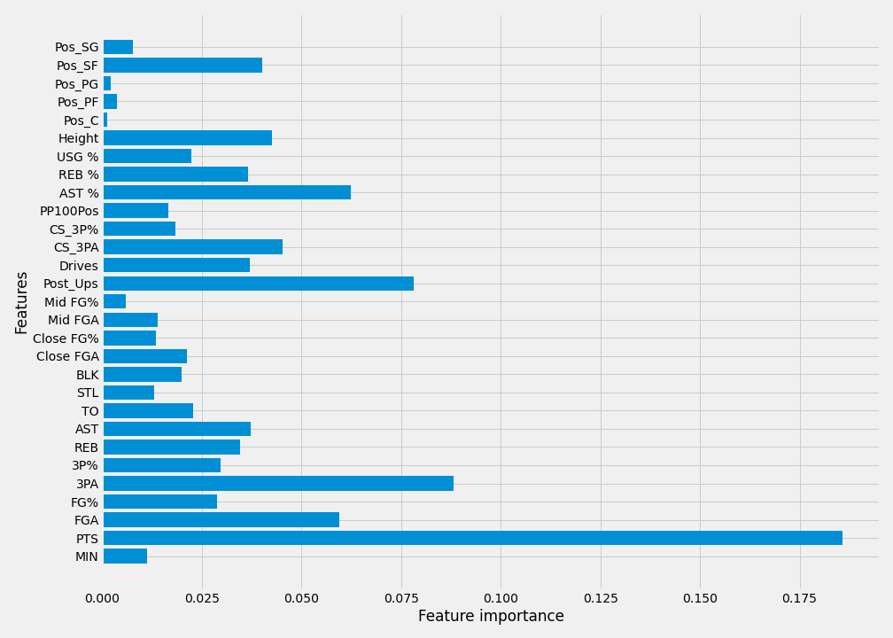

From the feature importance plot, we can see that points scored had an overwhelming effect on how these players were classified. Other strong features were post-ups, assist percentage, and 3PA.

The main goal of this project was to provide insight on how good and bad teams differ. 

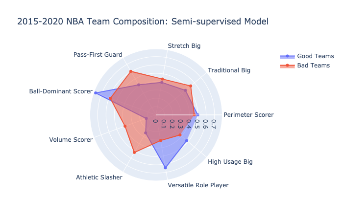

Looking at the radar plot, we can see that good teams tend to have more ball-dominant scorers and versatility in role players, while bad teams tend to have more athletic slashers, volume scorers, and pass-first guards. This shows that to be successful, a team needs at least 1 ball-dominant scorer to run the offense. As seen in recent years, spacing is golden, and we can see that bad teams tend to have more slashers. 

*Yearly plots are available in the "figures" folder while an option to view average teams as well is available in the plotting function.

### Unsupervised Learning
This method only requires 1 stage of modeling. In order to find the ideal number of clusters, we used several metrics. 

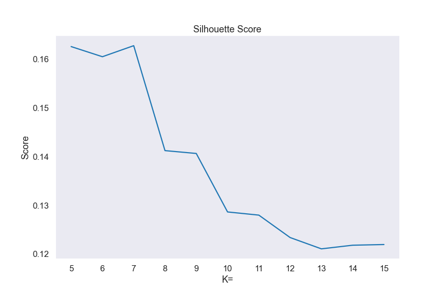

The silhouette score measures the average distance between each point in a cluster ie. how distinct and well-distinguished is each cluster from the other. We are looking for a way to classify beyond the 5 position system, thus we look for the best score that is greater than 5, which happens to be 7.

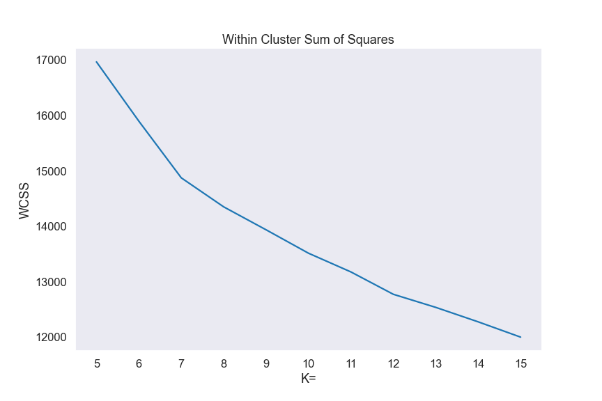

This next plot shows the within cluster sum of squares for kmeans models of different cluster ranges. The within-cluster sum of squares measures the variability of the observations within each cluster with a small sum of squares indicating a more compact cluster. In this case, we are looking for an "elbow" and while it is not as obvious as the silhouette score, we can see a slight elbow at 7 kmeans clusters. Now that we know we want 7 clusters, the model yielded these groups averages:

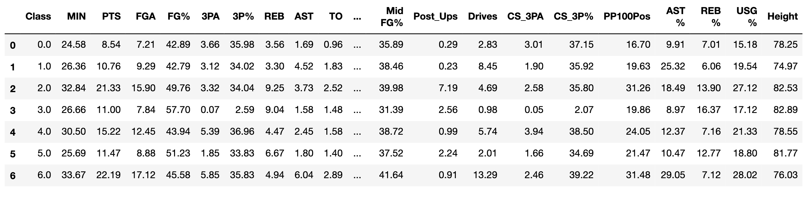

Using these stats, we came up with these labels:

* **Role Player** - Contributes but does not excel in any area, mostly shoots catch-and-shoot 3s
* **Pass-First Guard** - High assist rate, drives in a lot
* **High-Usage Big** - Scores a lot, rebounds well, takes a lot of shots inside the paint at a high percentage
* **Traditional Big** - Rebounds and blocks shots well, rarely shoots and almost exclusively takes shots inside
* **Perimeter Scorer** - Takes a lot of 3-pointers (mostly catch-and-shoot), some contributions in other areas
* **Athletic Wing** - Mostly takes shots/dunks from inside, only shoots catch-and-shoot 3s, rebounds well
* **Ball-Dominant Scorer** - "Best" player on a team, main contributor in anything offensive related

The corresponding radar plot is shown below:

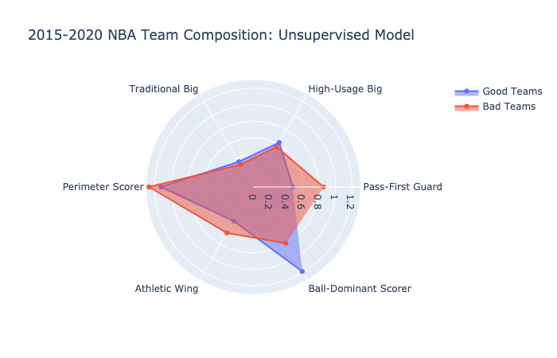

From this, we can see that good teams tend to have more ball-dominant scorers while bad teams tend to have more slashers and pass-first guards, which is exactly what we saw with the semi-supervised model (versatile role players and volume scorers were not included in the 7 clusters).

*Yearly plots are available in the "figures" folder while an option to view average teams as well is available in the plotting function.

## Future Work

There are a few tweaks and alternate directions that would be interesting to explore in the future.

1) Creating a dashboard that implements the classification model to spit out a playstyle when the user inputs their own statistics

2) Creating a dashboard that uses the plotting function to provide a user-interactive way to quickly view radar plots depending on their desired parameters (what year, which kind of teams (good/average/bad), etc.)

3) Bringing in more defensive stats to the model would possibly provide us with player classifications that center around defense, rather than our current ones, which mainly describe a player's offense