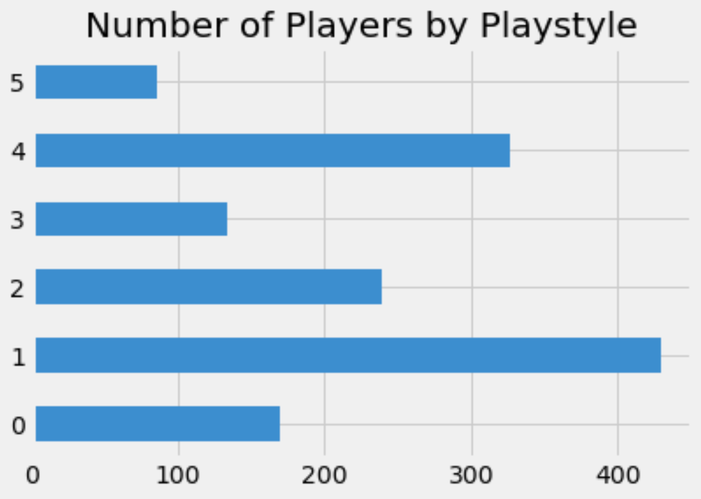
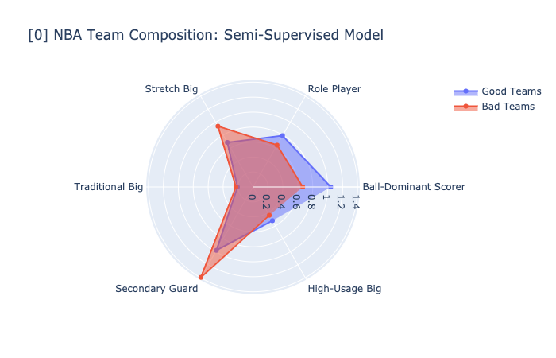

# NBA Player Classification

Author: Hogan Byun

## Project Overview

The game of basketball has certainly evolved over time. Point guards are no longer relagated to just passing duties, centers are no longer just tall players who post-up and rebound. As a result, classifying players by position starts to become less relevant as teams move into an era of "positionless" basketball, where players are asked to play and guard multiple positions. This project provides different ways to classify players into playstyles rather than the traditional five positions (PG, SG, SF, PF, C). Using these classifications, NBA teams can find a better understanding of the types of players that succesful teams have and unsuccessful teams lack. This can prove to be useful to teams that want to identify initial steps to improve their rosters.

## The Data

All the data has been curated from https://www.basketball-reference.com/ and https://www.nba.com/stats/

In total, there were 3,067 player seasons used for this project. These players include all players from 2015-2021 that have at least 20% of his respective team's games. The abbreviations for each stat are listed below:

* **Player** - Player name
* **GP** - Games played
* **MIN** - Minutes played per game
* **PTS** - Points per game
* **FGA** -  Field goal attempts per game
* **FG%** -  Field goal percentage
* **3PA** -  3-point attempts per game
* **3P%** -  3-point percentage
* **REB** -  Rebounds per game
* **AST** -  Assists per game
* **TO** - Turnovers per game
* **STL** - Steals per game
* **BLK** - Blocks per game
* **Close FGA** - Close field goal attempts per game (defined by any shot closer than a midrange shot)
* **Close FG%** - Close field goal percentage
* **Mid FGA** - Midrange field goal attempts per game
* **Mid FG%** - Midrange field goal percentage
* **Post_ups** - Post-ups per game
* **Drives** - Drives per game
* **CS_3PA** - Catch-and-shoot 3-point attempts per game
* **CS_3P%** - Catch-and-shoot 3-point percentage
* **PP100Pos** - Points per 100 possessions
* **AST%** - Percentage of team assists credited to that player
* **REB%** - Percentage of total available rebounds credited to that player
* **USG%** - Estimate of the percentage of team plays used by a player while he was on the floor: calculated by 100*((Player's Field Goal Attempts)+0.44*(Player's Free Throw Attempts)+(Player's Turnovers))*(Team's Total Minutes)
* **Height** - Player height in inches
* **Pos** - Player's position
* **Class** - Player's playstyle (number varies depending on model)
* **TEAM** - Player's team

## Methods
### Semi-Supervised Learning

This project analyzes NBA player statistics to claassify players into distinct playstyles/classes. This project used **semi-supervised learning**, which is a combination of **unsupervised** and **supervised** learning. Using k-means clustering, the players were separate into groups, after which, labels were given based on the average stats of each group.

Clustering showed that 6 groups provided the best balance of intra and inter cluster separation. Those being:
* **Ball-Dominant Scorer** - "Best" player on a team, main contributor in anything offensive related
* **Role Player** - Contributes but does not excel in any area
* **Stretch Big** - Shoots more 3PT and drives in more than a traditional big in exchange for less rebounds
* **Traditional Big** - Rebounds and blocks shots well, rarely shoots and almost exclusively takes shots inside
* **Secondary Guard** - Drives and assists with above average 3PT shooting, shortest average height
* **High-Usage Big** - Scores a lot, rebounds well, takes a lot of shots inside the paint at a high percentage

Our final model was trained on the newly labeled data. Several classification methods (Random Forest, XGBoost, SVM, etc.) were utilized and optimized to narrow down to a best-fit model, the best results coming from neural networks.

* This project will be following the OSEMN data-science process

## Background/Issues Addressed
Before we get into the results, there are a few things that need to be mentioned:

### Dealing with Multiple Seasons of the Same Player

The graphic from our powerpoint above shows two interesting points. **1)** A player's position does not determine the player's playstyle. **2)** A player may not play the same way throughout his career. A prime example is Brook Lopez who in one year raised the number of 3-pointers he shot by around **2500%**! In one season, he went from a *Traditional Big* to a *Stretch Big*. In order to account for this, each season of a player counted as separate players. In other words, 2015 Brook Lopez and 2016 Brook Lopez were counted as different players in our model. This process was repeated for each player from 2015-2021, which also helps in giving us more data to work with.

### 3-Point Era
There is no doubt that recent years have seen a boom in 3-point shooting. Teams started to realize that rather than shooting a midrange shot for 2 points, it is much more efficient to take a few steps back and shoot for 3 points. We can see that there has been a constant increas in 3-point shots and a corresponding decrease in 2-point shots. The big turning point was thought to be in following the 2014-15 season, when **1)** Stephen Curry, who is widely considered to be the best shooter ever, won his first MVP, **2)** his team, the Golden State Warriors finished with the best 3-point percentage in the NBA (39.8%) and **3)** the Warriors finished with the record in the NBA (67-15) and were NBA champions. The Warriors would continue to find great success as a team built on shooting 3-pointers.

Above show the recent trends in shot location, some with more detail than others.

## Results
Our best model ended up being a neural network, which gave us training accuracy of 97.3% and test accuracy of 94.2%. Our loss came out to be 0.0926.

We can see that although we started out with around the same number of each class, there are definitely more of one class than others, that being class 1 (Role Player). This makes sense because an NBA team only has 5 starters and a few bench players that earn enough minutes to contribute enough to be classified. However, an average NBA team has 12 players, of which, quite a few may not receive enough minutes to be classified. 

The main goal of this project was to provide insight on how good and bad teams differ. 

Looking at the radar plot, we can see that good teams tend to have more ball-dominant scorers and versatility in role players, while bad teams tend to have more secondary guards and stretch bigs. This does not necessarily show that a team with secondary guards and stretch bigs won't succeed. Rather, I believe this shows more about the importance of a Ball-Dominant Scorer and that in today's NBA, it is better to have a superstar surrounded by decent players, than a team with a better depth of good players. 

*Yearly plots are available in the "figures" folder while an option to view average teams as well is available in the plotting function.

## Future Work

There are a few tweaks and alternate directions that would be interesting to explore in the future.

1) Creating a dashboard that implements the classification model to spit out a playstyle when the user inputs their own statistics

2) Creating a dashboard that uses the plotting function to provide a user-interactive way to quickly view radar plots depending on their desired parameters (what year, which kind of teams (good/average/bad), etc.)

3) Bringing in more defensive stats to the model would possibly provide us with player classifications that center around defense, rather than our current ones, which mainly describe a player's offense